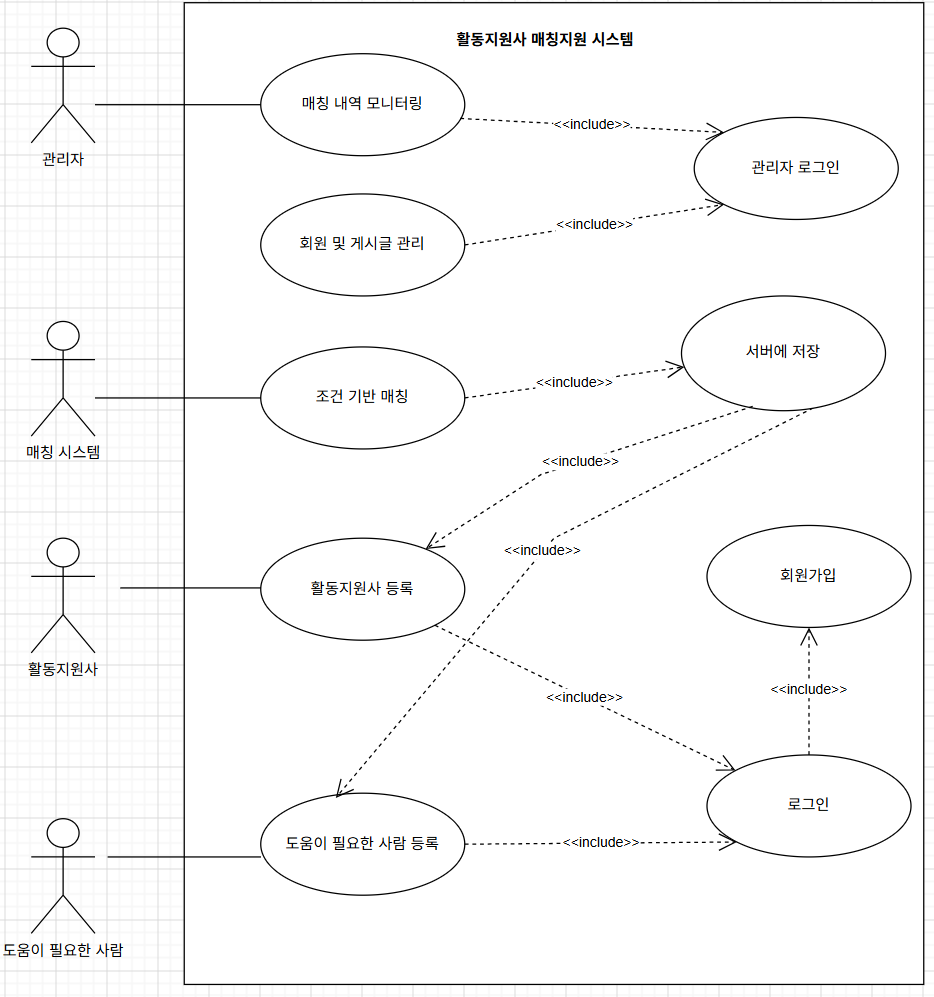
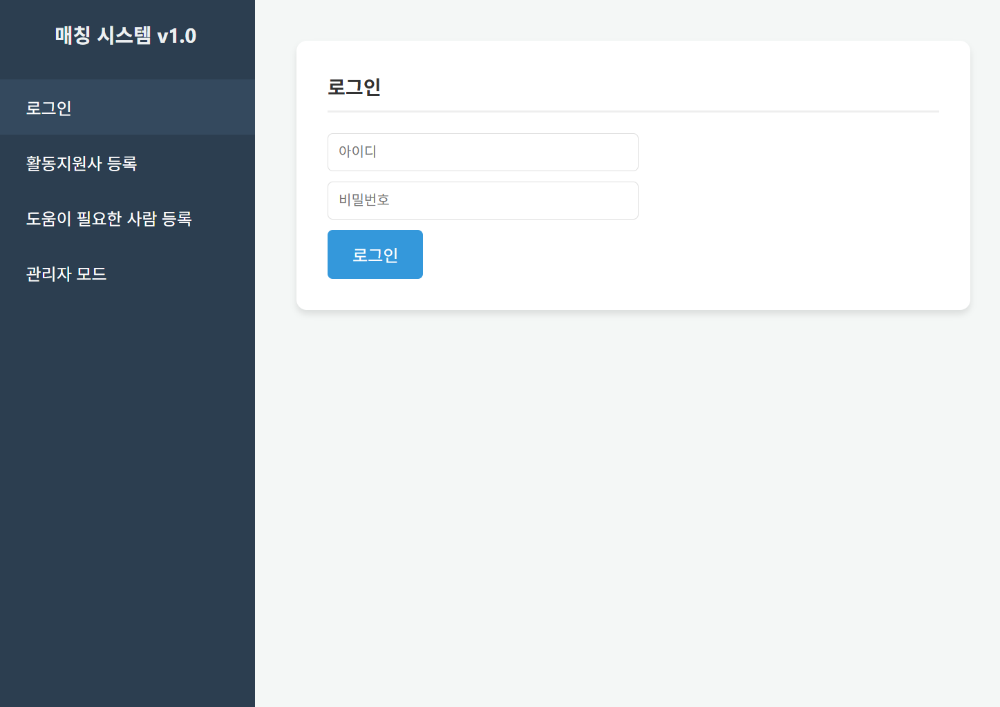
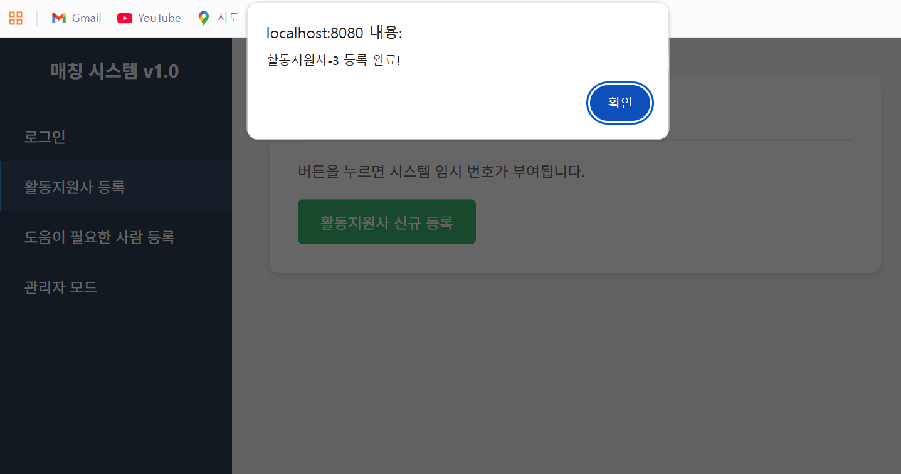
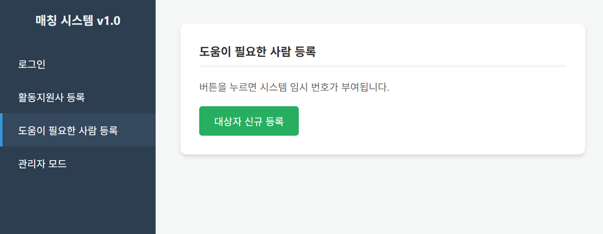
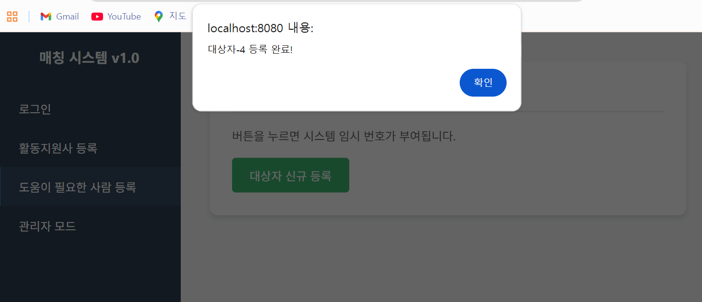
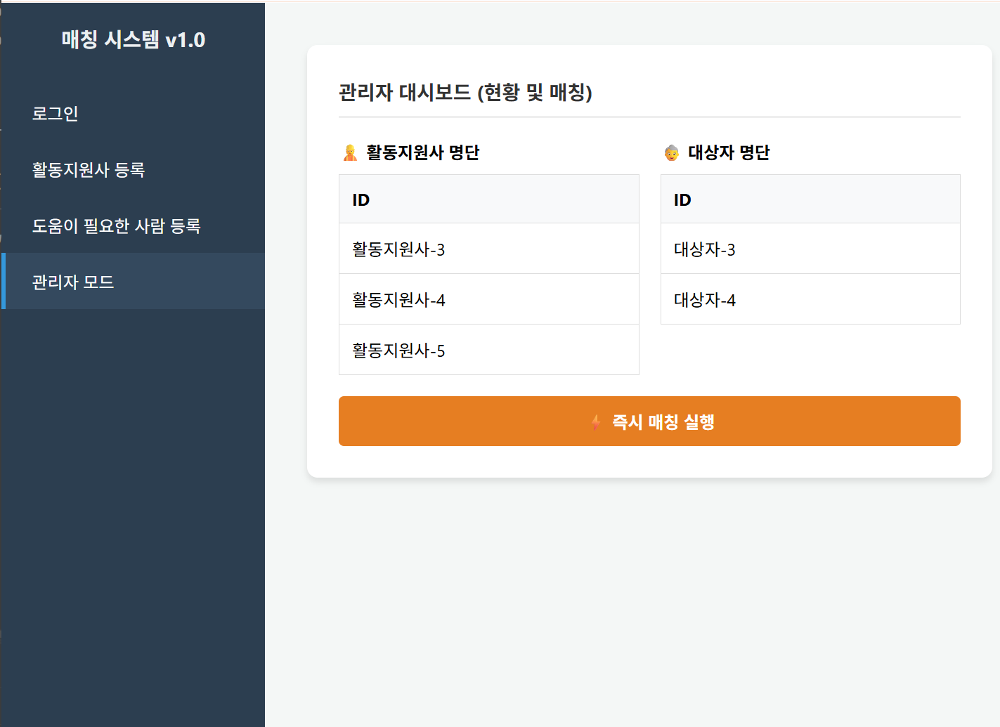

# Always by your side.

### Analysis Document

### [Revision history]
<table style = "width : 150%">
  <thead>
    <tr height="50">
      <th>Revisiom date</th>
      <th>Version #</th>
      <th>Description</th>
      <th>Author</th>
    </tr>
    <tr height="30">
      <td>26.05.08</td>
      <td>1.0</td>
      <td>First Writing</td>
      <td></td>
    </tr>
    <tr height="30">
      <td></td>
      <td></td>
      <td></td>
      <td></td>
    </tr>
    <tr height="30">
      <td></td>
      <td></td>
      <td></td>
      <td></td>
    </tr>
</table>  

## Contents

### 1. Introduction----------------------------------------------------------------
    
### 2. Use case analysis----------------------------------------------------------

### 3. Domain analysis-----------------------------------------------------------

### 4. User Interface prototype--------------------------------------------------

### 5. Glossary-------------------------------------------------------------------

### 6. References-----------------------------------------------------------------

### 1.introduction
#### 1)	summary
최근 급속한 고령화로 인해 사회적으로 필요한 복지 시설의 무게중심이 영유아 시설에서 요양 및 돌봄 시설로 이동하고 있습니다. 이에 따라 돌봄이 필요한 고령층은 급증하고 있으나, 수요에 비해 공급은 턱없이 부족한 실정입니다.
특히 현장에서는 일자리를 찾는 활동지원사와 실제 돌봄이 필요한 대상자 간의 구체적인 요구사항(누가, 어떤 종류의 도움을, 어떻게 받기를 원하는지)이 투명하게 공유되지 않아 일자리 미스매칭이 발생하고 있습니다. 즉, 일하고 싶은 지원사는 일자리를 얻지 못하고, 도움을 갈망하는 수혜자는 방치되는 악순환이 거듭되고 있습니다.
이에 본 프로젝트는 활동지원사와 수요자를 다이렉트로 연결하는 '통합 매칭 플랫폼 시스템'을 제안합니다. 이를 통해 불필요한 행정 절차를 과감히 축소하고, 수요와 공급의 불균형을 해결하여 복지 사각지대를 해소하고자 합니다
##### 2)	business Goals
- 활동지원사와 도움이 필요한사람이 각자의 필요한 기능을 수행할 수 있도록 프로그램 내에서 명확하게 표시해야 한다.
- 활동지원사와 도움이 필요한사람이 적절하게 매칭 되어야 한다.
- 활동내역을 관리자가 보기 편리해야 한다.
- 매칭이 되었으나 지원 포기 시 패널티를 부여하여 부정행위를 막아야 한다.

##### 3)	Technical Goals
- 도움이 필요한사람이 누구의 도움이 필요한지를 정확히 분류해야 한다.
- 활동지원사가 누구를 도와줄 수 있는지 정확히 분류해야 한다.
- 활동지원사와 도움이 필요한사람의 정보를 안전하고 정확하게 저장하고 있어야 한다.
- 웹 UX/UI는 연령층에 상관없이 사용자 모두가 사용하기 편해야 한다

### 2.Use case analysis
#### 2.1 Use case diagram

#### 2.2 Use case description
[//]:# (회원가입)
<table style = "width : 100%">
  <thead>
    <tr>
      <td width = "20%">유스케이스명</td>
      <td width = "80%">회원가입</td>
    </tr>
    <tr>
      <td width = "20%">액터명</td>
      <td width = "80%">주 액터: 활동지원사, 도움이 필요한 사람 
                        부 액터: 인증시스템, 매칭시스템</td>
    </tr>
    <tr>
      <td width = "20%">개요</td>
      <td width = "80%">사용자가 시스템을 이용하기 위해 일부 권한을 허가받기 위해 등록한다.</td>
    </tr>
    <tr>
      <td width = "20%">사전조건</td>
      <td width = "80%">-이전에 가입한 적 없는 아이디이여야 한다. 
                        -비밀번호가 보안수준에 적합하여야한다. 
                        -네트워크에 연결되어있어야 한다.</td>
    </tr>
    <tr>
      <td width = "20%">사후조건</td>
      <td width = "80%">-회원정보를 데이터베이스에 잘 저장한다. 
                        -회원에게 로그인 할 수 있게 하고 로그인 시 시스템을 이용할 권한을 부여한다. 
                        -회원정보를 등록하지 못하고 아이디 중복확인을 하라고 메시지를 띄운다.</td>
    </tr>
    <tr>
      <td width = "20%">기본흐름</td>
      <td width = "80%">1.활동지원사와 도움이 필요한 사람은 시스템에서 회원가입 버튼을 누른다. 
                        2.시스템은 회원가입 창을 띄워 아이디와 비밀번호를 포함한 간단한 개인정보를 요구한다. 
                        3.활동지원사와 도움이 필요한 사람은 사용할 아이디와 비밀번호, 간단한 개인정보를 입력한다. 
                        4.활동지원사와 도움이 필요한 사람은 아이디와 개인정보 중복확인 통해 동일한 아이디가 이미 가입되어 있는지 확인한다. 
                        5.정상적으로 입력이 되었다면 시스템은 회원정보를 데이터베이스에 저장하고 로그인 할 권한을 부여한다. 
                        6.회원가입이 완료되었다고 알려준다.</td>
    </tr>
    <tr>
      <td width = "20%">대체흐름1</td>
      <td width = "80%">3a. 잘못된 개인정보가 입력된경우. 
                          &emsp;3a.1개인정보가 잘못 입력되었으니 확인해달라고 요청.</td>
    </tr>
    <tr>
      <td width = "20%">대체흐름2</td>
      <td width = "80%">4a. 아이디 중복확인을 하였을 때 중복인 경우. 
                          &emsp;4a.1 이미 가입된 아이디임을 알리고 다른 아이디를 입력하라고 알린다. 
                        4b 이미 가입된 적 있는 개인정보일 경우. 
                          &emsp;4b.1 이미 가입되어 있는 회원임을 알리고 유스케이스 종료한다.</td>
    </tr>
    <tr>
      <td width = "20%">수행능력</td>
      <td width = "80%"></td>
    </tr>
</table>

[//]:# (로그인)
<table style = "width : 100%">
  <thead>
    <tr>
      <td width = "20%">유스케이스명</td>
      <td width = "80%">로그인</td>
    </tr>
    <tr>
      <td width = "20%">액터명</td>
      <td width = "80%">주 액터 : 활동지원사, 도움이 필요한 사람 
                        부 액터 : 인증시스템 </td>
    </tr>
    <tr>
      <td width = "20%">개요</td>
      <td width = "80%">사용자가 시스템에 접속하여 서비스를 이용하기 위해 등록된 신원 정보를 확인받는 절차이다.</td>
    </tr>
    <tr>
      <td width = "20%">사전조건</td>
      <td width = "80%">-사용자가 이미 회원가입이 완료된 상태여야 한다.  
                        -네트워크에 연결되어 있어야 한다.</td>
    </tr>
    <tr>
      <td width = "20%">사후조건</td>
      <td width = "80%">-사용자 인증이 성공하여 세션이 생성된다.  
                        -등록/매칭 등의 개인화된 서비스를 이용할 권한을 얻는다.  
                        -실패 시 로그인 페이지에 머물며 오류 메시지를 표시한다.</td>
    </tr>
    <tr>
      <td width = "20%">기본흐름</td>
      <td width = "80%">1.사용자는 로그인 화면에서 아이디와 비밀번호를 입력한다.  
                        2.시스템은 입력된 정보가 데이터베이스의 회원 정보와 일치하는지 확인한다.  
                        3.일치할 경우 사용자에게 권한을 부여한다.  
                        4.시스템은 로그인이 성공했음을 알리고 메인 화면으로 이동한다.</td>
    </tr>
    <tr>
      <td width = "20%">대체흐름1</td>
      <td width = "80%">2a. 아이디나 비밀번호가 일치하지 않는 경우 
                          &emsp;2a.1정보가 일치하지 않습니다" 메시지를 띄우고 재입력을 요구한다</td>
    </tr>
    <tr>
      <td width = "20%">대체흐름2</td>
      <td width = "80%">3a. 계정이 휴면 상태이거나 정지된 경우 
                          &emsp;3a.1사유를 안내하고 관리자에게 문의하도록 유도한다.</td>
    </tr>
    <tr>
      <td width = "20%">수행능력</td>
      <td width = "80%"></td>
    </tr>
</table>

[//]:# (활동지원사 등록)
<table style = "width : 100%">
  <thead>
    <tr>
      <td width = "20%">유스케이스명</td>
      <td width = "80%">활동지원사 등록</td>
    </tr>
    <tr>
      <td width = "20%">액터명</td>
      <td width = "80%">주 액터 : 활동지원사 
                        부 액터 : 매칭 시스템</td>
    </tr>
    <tr>
      <td width = "20%">개요</td>
      <td width = "80%">활동지원사가 자신의 전문성, 활동 가능 시간 및 지역 정보를 시스템에 등록한다.</td>
    </tr>
    <tr>
      <td width = "20%">사전조건</td>
      <td width = "80%">-활동지원사 계정으로 로그인이 되어 있어야 한다 
                        -필수 자격증 사본 등 등록에 필요한 정보가 준비되어야 한다.</td>
    </tr>
    <tr>
      <td width = "20%">사후조건</td>
      <td width = "80%">-입력된 정보가 서버의 활동지원사 풀(Pool)에 추가된다.  
                        -'서버에 저장' 유스케이스를 통해 영구 기록된다.  
                        -매칭 대기 상태로 전환되어 시스템이 추천을 시작할 수 있게 된다.</td>
    </tr>
    <tr>
      <td width = "20%">기본흐름</td>
      <td width = "80%">1.사용자는 활동지원사 전용 등록 메뉴를 선택한다.  
                        2.시스템은 자격 요건 및 활동 희망 조건 입력 양식을 제공한다.  
                        3.사용자는 이름, 연락처, 자격증, 희망 지역 및 시간을 입력한다.  
                        4.시스템은 입력값의 유효성을 검사한 후 '서버에 저장' 기능을 호출한다.  
                        5.등록 완료 메시지를 사용자에게 보여준다</td>
    </tr>
    <tr>
      <td width = "20%">대체흐름1</td>
      <td width = "80%">4a. 자격증 번호 형식이 올바르지 않은 경우 
                          &emsp;4a.1수정이 필요함을 알리고 해당 항목으로 포커스를 이동한다.</td>
    </tr>
    <tr>
      <td width = "20%">대체흐름2</td>
      <td width = "80%">4b. 필수 항목이 누락된 경우 
                          &emsp;4b.1"필수 입력 사항입니다"라는 경고창을 띄운다.</td>
    </tr>
    <tr>
      <td width = "20%">수행능력</td>
      <td width = "80%"></td>
    </tr>
</table>

[//]:# (도움이 필요한 사람 등록)
<table style = "width : 100%">
  <thead>
    <tr>
      <td width = "20%">유스케이스명</td>
      <td width = "80%">도움이 필요한 사람 등록</td>
    </tr>
    <tr>
      <td width = "20%">액터명</td>
      <td width = "80%">주 액터 : 도움이 필요한 사람 
                        부 액터 : 매칭 시스템</td>
    </tr>
    <tr>
      <td width = "20%">개요</td>
      <td width = "80%">지원이 필요한 사용자가 자신의 건강 상태, 필요한 서비스 종류 및 장소를 등록한다.</td>
    </tr>
    <tr>
      <td width = "20%">사전조건</td>
      <td width = "80%">-도움이 필요한 사람 계정으로 로그인이 완료되어야 한다.  
                        -네트워크 상태가 안정적이어야 한다.</td>
    </tr>
    <tr>
      <td width = "20%">사후조건</td>
      <td width = "80%">-도움 요청 데이터가 생성되어 서버에 저장된다.  
                        -매칭 알고리즘의 대상 데이터로 포함된다.</td>
    </tr>
    <tr>
      <td width = "20%">기본흐름</td>
      <td width = "80%">1. 사용자는 도움 요청 등록 메뉴에 접속한다 .
                        2. 시스템은 필요한 도움의 유형(거동 보조, 식사 지원 등)을 선택하는 양식을 제공한다.  
                        3. 사용자는 서비스 장소, 희망 일시, 본인의 특이사항을 상세히 입력한다.  
                        4. 시스템은 입력 내용을 검토하고 '서버에 저장' 유스케이스를 수행한다.  
                        5. 등록이 성공적으로 완료되었음을 안내한다.</td>
    </tr>
    <tr>
      <td width = "20%">대체흐름1</td>
      <td width = "80%">3a. 서비스 불가능 지역을 입력한 경우 
                          &emsp;3a.1현재 서비스 지원 외 지역임을 알리고 안내 사항을 전달한다.</td>
    </tr>
    <tr>
      <td width = "20%">수행능력</td>
      <td width = "80%"></td>
    </tr>
</table>

[//]:# (서버에 저장)
<table style = "width : 100%">
  <thead>
    <tr>
      <td width = "20%">유스케이스명</td>
      <td width = "80%">서버에 저장</td>
    </tr>
    <tr>
      <td width = "20%">액터명</td>
      <td width = "80%">주 액터 : 매칭 시스템</td>
    </tr>
    <tr>
      <td width = "20%">개요</td>
      <td width = "80%">시스템 내에서 발생하는 모든 트랜잭션 데이터를 데이터베이스에 안전하게 기록한다.</td>
    </tr>
    <tr>
      <td width = "20%">사전조건</td>
      <td width = "80%">-저장할 데이터가 유효성 검사를 통과한 상태여야 한다.  
                        -데이터베이스 서버와 연결이 확립되어 있어야 한다.</td>
    </tr>
    <tr>
      <td width = "20%">사후조건</td>
      <td width = "80%">-데이터베이스에 새로운 레코드가 생성되거나 기존 레코드가 갱신된다.  
                        -데이터 무결성이 유지된다.</td>
    </tr>
    <tr>
      <td width = "20%">기본흐름</td>
      <td width = "80%">1.	호출한 유스케이스로부터 데이터 패킷을 수신한다.  
                        2.	시스템은 데이터베이스의 테이블 구조에 맞춰 쿼리를 생성한다.  
                        3.	생성된 쿼리를 실행하여 데이터를 물리적 저장소에 기록한다.  
                        4.	저장이 성공하면 호출 유스케이스에 '성공' 응답을 보낸다.</td>
    </tr>
    <tr>
      <td width = "20%">대체흐름1</td>
      <td width = "80%">3a. 서버 용량 부족이나 연결 끊김으로 저장 실패 시 
                          &emsp;3a.1오류 로그를 남기고 사용자에게 잠시 후 재시도를 요청한다.</td>
    </tr>
    <tr>
      <td width = "20%">대체흐름2</td>
      <td width = "80%">3b. 저장하려는 데이터의 용량이 서버 허용 범위를 초과한 경우.  
                          &emsp;3b.1 시스템은 용량 초과 오류를 기록하고, 데이터 크기를 줄여달라는 안내를 보낸다.</td>
    </tr>
    <tr>
      <td width = "20%">수행능력</td>
      <td width = "80%"></td>
    </tr>
</table>

[//]:# (조건기반 매칭)
<table style = "width : 100%">
  <thead>
    <tr>
      <td width = "20%">유스케이스명</td>
      <td width = "80%">조건기반 매칭</td>
    </tr>
    <tr>
      <td width = "20%">액터명</td>
      <td width = "80%">주 액터 : 매칭 시스템</td>
    </tr>
    <tr>
      <td width = "20%">개요</td>
      <td width = "80%">등록된 활동지원사와 도움 요청자의 데이터를 상호 비교하여 최적의 파트너를 자동으로 선별한다.</td>
    </tr>
    <tr>
      <td width = "20%">사전조건</td>
      <td width = "80%">-활동지원사 및 도움 요청자의 최신 등록 데이터가 존재해야 한다.  
                        -매칭 알고리즘 파라미터가 설정되어 있어야 한다.  
                        -'서버에 저장' 유스케이스를 포함(include)한다.</td>
    </tr>
    <tr>
      <td width = "20%">사후조건</td>
      <td width = "80%">-매칭 결과 세트가 생성되어 양측 사용자에게 통보된다.  
                        -매칭 성사 내역이 '서버에 저장'된다.</td>
    </tr>
    <tr>
      <td width = "20%">기본흐름</td>
      <td width = "80%">1.	시스템은 새로운 등록 건이 발생하거나 주기적인 시간이 되면 알고리즘을 가동한다.  
                        2.	데이터베이스에서 활성화된 양측 액터의 조건을 추출한다.  
                        3.	지역, 시간, 선호 직무 등의 가중치를 계산하여 일치 점수를 산출한다.  
                        4.	기준 점수 이상의 대상자를 매칭 후보로 확정한다.  
                        5.	확정된 결과를 '서버에 저장'하고 각 액터에게 알림을 발송한다.</td>
    </tr>
    <tr>
      <td width = "20%">대체흐름1</td>
      <td width = "80%">4a. 조건이 일치하는 상대가 단 한 명도 없는 경우 
                          &emsp;4a.1매칭 실패 상태로 두고 추후 재매칭 리스트에 등록한다.</td>
    </tr>
    <tr>
      <td width = "20%">대체흐름2</td>
      <td width = "80%">4b. 매칭 후보자의 필수 프로필 정보가 누락되어 점수 산출이 안 되는 경우.  
                          &emsp;4b.1 시스템은 해당 후보를 매칭 대상에서 제외하고 관리자에게 데이터 보정 알림을 보낸다.</td>
    </tr>
    <tr>
      <td width = "20%">수행능력</td>
      <td width = "80%"></td>
    </tr>
</table>

[//]:# (관리자 로그인)
<table style = "width : 100%">
  <thead>
    <tr>
      <td width = "20%">유스케이스명</td>
      <td width = "80%">관리자 로그인</td>
    </tr>
    <tr>
      <td width = "20%">액터명</td>
      <td width = "80%">주 액터 : 관리자 
                        부 액터 : 인증시스템</td>
    </tr>
    <tr>
      <td width = "20%">개요</td>
      <td width = "80%">시스템 관리 권한을 가진 사용자가 관리자 전용 대시보드에 접근하기 위해 인증한다.</td>
    </tr>
    <tr>
      <td width = "20%">사전조건</td>
      <td width = "80%">- 관리자 고유 식별 번호와 보안 키가 있어야 한다.  
                        -관리자 전용 IP 또는 보안 채널을 통해 접근해야 한다.</td>
    </tr>
    <tr>
      <td width = "20%">사후조건</td>
      <td width = "80%">-관리자 전용 메뉴(모니터링, 회원 관리 등)가 활성화된다.  
                        -모든 시스템 데이터에 대한 조회 및 수정 권한이 부여된다.</td>
    </tr>
    <tr>
      <td width = "20%">기본흐름</td>
      <td width = "80%">1.	관리자는 관리자 전용 접속 주소로 입장한다.  
                        2.	관리자 ID와 암호화된 비밀번호를 입력한다.  
                        3.	시스템은 최고 관리자 권한 여부를 데이터베이스와 대조한다.  
                        4.	인증 성공 시 관리 대시보드 메인 화면을 출력한다.</td>
    </tr>
    <tr>
      <td width = "20%">대체흐름1</td>
      <td width = "80%">3a. 연속 5회 이상 로그인 실패 시 
                          &emsp;3a.1해당 관리자 계정을 일시 잠금하고 보안 팀에 알린다.</td>
    </tr>
    <tr>
      <td width = "20%">대체흐름2</td>
      <td width = "80%">3b. 미승인된 외부 IP 주소에서 접근을 시도한 경우.  
                          &emsp;3b.1 시스템은 비정상적인 접근 시도로 판단하여 접속을 즉시 차단한다.</td>
    </tr>
    <tr>
      <td width = "20%">수행능력</td>
      <td width = "80%"></td>
    </tr>
</table>

[//]:# (매칭 내역 모니터링)
<table style = "width : 100%">
  <thead>
    <tr>
      <td width = "20%">유스케이스명</td>
      <td width = "80%">매칭 내역 모니터링</td>
    </tr>
    <tr>
      <td width = "20%">액터명</td>
      <td width = "80%">주 액터 : 관리자</td>
    </tr>
    <tr>
      <td width = "20%">개요</td>
      <td width = "80%">관리자가 시스템에서 이루어지는 모든 매칭 진행 상황과 성사율을 실시간으로 감시한다.</td>
    </tr>
    <tr>
      <td width = "20%">사전조건</td>
      <td width = "80%">-대시보드 시스템이 정상 작동 중이어야 한다.</td>
    </tr>
    <tr>
      <td width = "20%">사후조건</td>
      <td width = "80%">-특정 기간이나 지역별 매칭 통계 보고서를 생성할 수 있다.  
                        -문제가 발생한 매칭 건에 대해 개입할 근거 정보를 확보한다.</td>
    </tr>
    <tr>
      <td width = "20%">기본흐름</td>
      <td width = "80%">1.	관리자는 관리 메뉴에서 '실시간 매칭 모니터링'을 선택한다.  
                        2.	시스템은 현재 진행 중인 매칭 상태를 지도 또는 리스트 형태로 시각화한다.  
                        3.	관리자는 특정 매칭 건을 클릭하여 세부 대화나 매칭 조건을 상세 조회한다.  
                        4.	시스템은 매칭 성사, 대기, 취소 등의 통계 데이터를 주기적으로 갱신한다.</td>
    </tr>
    <tr>
      <td width = "20%">대체흐름1</td>
      <td width = "80%">3a. 매칭 과정에서 분쟁 신고가 접수된 건이 발견될 경우 
                          &emsp;3a.1관리자 하이라이트 기능을 통해 우선적으로 확인한다.</td>
    </tr>
    <tr>
      <td width = "20%">대체흐름2</td>
      <td width = "80%">	3b. 실시간 데이터 로딩 중 시스템 과부하가 발생한 경우.  
                            &emsp;3b.1 시스템은 대기 알림을 띄우고 데이터를 순차적으로 페이징하여 불러온다.</td>
    </tr>
    <tr>
      <td width = "20%">수행능력</td>
      <td width = "80%"></td>
    </tr>
</table>

[//]:# (회원 및 게시글 관리)
<table style = "width : 100%">
  <thead>
    <tr>
      <td width = "20%">유스케이스명</td>
      <td width = "80%">회원 및 게시글 관리</td>
    </tr>
    <tr>
      <td width = "20%">액터명</td>
      <td width = "80%">주 액터 : 관리자</td>
    </tr>
    <tr>
      <td width = "20%">개요</td>
      <td width = "80%">-관리자 로그인' 유스케이스가 완료되어야 한다. 	
                        -관리 대상인 회원 DB 및 게시물 DB에 대한 쓰기 권한이 있어야 한다.</td>
    </tr>
    <tr>
      <td width = "20%">사전조건</td>
      <td width = "80%">부적절한 활동을 하는 회원을 제재하거나 권장되지 않는 게시물을 삭제하여 시스템 정체성을 유지한다.</td>
    </tr>
    <tr>
      <td width = "20%">사후조건</td>
      <td width = "80%">-위반 사항이 해결되거나 부적절한 데이터가 제거된다. 
                        -처리 결과가 해당 회원에게 통보되고 DB에 반영된다.</td>
    </tr>
    <tr>
      <td width = "20%">기본흐름</td>
      <td width = "80%">1.	관리자는 회원 목록 또는 전체 게시글 관리 메뉴로 이동한다. 
                        2.	신고가 들어온 항목이나 키워드 필터링으로 걸러진 대상을 조회한다. 
                        3.	관리자는 위반 내용을 확인하고 '수정', '삭제', '회원 정지' 등의 조치를 취한다. 
                        4.	시스템은 변경된 상태를 '서버에 저장'하고 처분 결과를 기록한다. 
                        5.	관리자에게 조치가 완료되었음을 피드백한다.</td>
    </tr>
    <tr>
      <td width = "20%">대체흐름1</td>
      <td width = "80%">3a. 실수로 삭제한 경우 
                          &emsp;3a.1관리자 전용 '휴지통' 기능을 통해 일정 시간 내에 복구를 시도한다.</td>
    </tr>
    <tr>
      <td width = "20%">대체흐름2</td>
      <td width = "80%">•	3b. 관리자 권한 등급을 넘어서는 회원의 정보를 수정하려 하는 경우. 
                            &emsp;3b.1 시스템은 "권한이 부족합니다"라는 경고 메시지를 띄우고 작업을 중단한다.</td>
    </tr>
    <tr>
      <td width = "20%">수행능력</td>
      <td width = "80%"></td>
    </tr>
</table>
    
### 3. Domain analysis

#### 1) Control
활동지원사 매칭 시스템에서 여러 클래스가 공통으로 사용하게 될 제어 메서드들을 포함한 클래스이다. 
ex) 화면 이동, 메시지 출력, 데이터 유효성 검사, 알림 보내기

#### 2) User
시스템을 이용하게 될 모든 유저(활동지원사, 도움인, 관리자)의 공통 정보를 가지는 클래스이다. 
ex) 아이디, 비밀번호, 이름, 전화번호, 생년월일, 가입일자

#### 3) SupportWorker
User를 상속받은 클래스로, 유저의 유형 중 하나인 '활동지원사'의 특화 정보를 가지는 클래스이다. 
ex) 자격증 번호, 경력 사항, 희망 시급, 활동 가능 지역, 전문 분야

#### 4) CareRecipient
User를 상속받은 클래스로, 유저의 유형 중 하나인 '도움이 필요한 사람'의 정보를 가지는 클래스이다. 
ex) 서비스 필요 장소, 신체 상태(장애 등급 등), 주요 요청 사항, 비상 연락처

##### 5) MatchingData
매칭 시스템에 의해 성사된 매칭 내역과 진행 상태 정보를 가지는 클래스이다. 
ex) 매칭 번호, 지원사 ID, 요청자 ID, 매칭 일시, 현재 진행 상태(대기/승인/종료)

#### 6) Board
시스템 내 공지사항이나 자유게시판 등 게시글의 정보를 가지는 클래스이다. 
ex) 글 번호, 제목, 작성자 ID, 작성일, 내용, 조회수

#### 7) ServerStorage
입력된 데이터를 데이터베이스에 영구적으로 기록하고 관리하는 기능을 담당하는 클래스이다. 
ex) 데이터 연결 정보, 저장 함수, 업데이트 함수, 데이터 로드 함수

#### 8) Login
활동지원사, 도움이 필요한 사람, 관리자가 시스템에 로그인할 때 사용되는 데이터와 메서드들이 포함된 클래스이다. 
ex) 입력 아이디, 입력 비밀번호, 인증 토큰, 로그인 처리 함수(doLogin)

#### 9) Join
신규 유저들이 시스템에 회원으로 등록할 때 필요한 핵심 기능들이 담긴 클래스이다. 
ex) 중복 확인(checkDuplicate), 이메일 인증(sendAuthMail), 회원 정보 설정(setProfile)

#### 10) MatchingSystem
조건 기반 매칭 알고리즘을 수행하고 최적의 대상을 선별하는 기능을 가지는 클래스이다. 
ex) 조건 필터링 함수, 점수 산출 함수, 매칭 결과 생성 함수

### 4. User interface prototype

활동지원사 및 도움이필요한사람이 로그인을 할 수 있도록 구현.
![활동지원사등록_프로토타입1]{image/활동지원사등록_프로토타입1.png)
활동지원사가 자신의 정보를 입력했다 가정하고 등록하는 기능을 구현. 

등록시 등록이 되었음을 표시함.

도움이필요한사람이 자신의 정보를 입력했다 가정하고 등록하는 기능을 구현

등록시 등록이 되었음을 표시함.

관리자모드로 들어갔을 시 등록현황을 볼 수 있고 매칭도 가능하도록 구현
### 5. Glossary

<table style = "width : 150%">
  <thead>
    <tr height="50">
      <th>Term</th>
      <th>Description</th>
    </tr>
    <tr height="30">
      <td></td>
      <td>1.0</td>
    </tr>
    <tr height="30">
      <td></td>
      <td></td>
    </tr>
    <tr height="30">
      <td></td>
      <td></td>
    </tr>
</table>  

