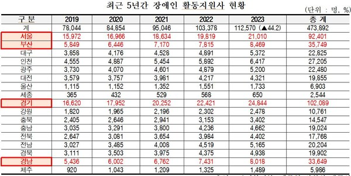
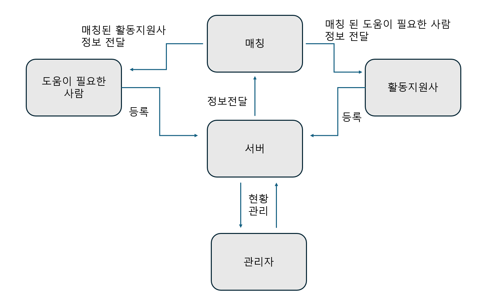

# 1. Conceptualization

## Always by your side.

[그림1]

22211972 이동준 (dongjun9021@naver.com)

 

## [ Revision history ]

**Revision** 
| date | Version | Description	| Author|
|-------------|--------|--------------------------------|---------|
| 03/27/2026 | 0.00 | fist start | dongjun |
			
			
			
			
			

 

## = Contents =

1. Business purpose ..................................................................................

2. System context diagram .......................................................................

3. Use case list .........................................................................................

4. Concept of operation ............................................................................ 

5. Problem statement ................................................................................

6. Glossary .................................................................................................

7. References .................................................................................................

 
## 1. Business purpose

[그림2]

   
장애인의 일상생활을 보조하는 장애인 활동지원사에 대한 수요와 공급이 증가하고 있지만, 장애인과 활동지원사 간 매칭이 제대로 이뤄지지 않고 있다는 분석이 나왔다. 시간당 3천원 수준인 활동지원사의 가산수당을 인상하는 등 처우 개선이 필요하단 지적도 제기됐다.

국회 보건복지위원회 소속 백종헌 국민의힘 의원이 13일 보건복지부로부터 제출받은 ‘최근 5년(2019~2023년)간 장애인 활동지원서비스 현황’ 자료를 보면, 장애인 활동지원사 수는 2019년 7만8044명에서 2023년 11만2570명으로 약 44.2% 증가했다. 해당 서비스를 이용하는 이들이 신청하는 활동지원급여 이용자 수도 같은 기간 9만2945명에서 12만8959명으로 39% 늘었다.

이처럼 활동지원에 대한 수요와 공급이 모두 증가하고 있지만, 일부 장애인들은 필요한 시간·필요한 유형의 서비스를 받기 어렵다는 문제 등으로 장기간 활동지원 서비스를 이용하지 않는 것으로 나타났다. 복지부가 활동지원급여를 6개월 이상 받지 않은 장기 미이용자 3387명(응답자 2782명)을 상대로 조사한 결과를 보면, 이 중 900명이 ‘활동지원사 미연계’를 미이용 사유로 답하면서 ‘필요한 시간에 서비스를 제공할 활동지원사 부족’(28.9%, 260명), ‘필요한 유형의 서비스를 제공할 활동지원사 부족’(21.0%, 189명)을 가장 큰 원인으로 꼽았다.

고령화가 진행중인 대한민국의 상황을 생각하면 앞으로 장애인 이외에도 활동지원사의 도움이 필요한 사람은 매년 점차 증가할 것으로 보이는데 활동지원사들과 도움이 필요한 사람 간의 매칭을 도와주는 프로그램이 있으면 도움이 필요하나 도움을 받지 못하게 되는 사람이 줄어들 것이라고 생각이 들었다. 

## 2. System context diagram
 

[그림3]
-로그인
-회원가입
-관리자로 로그인
-활동지원사 등록
-도움이 필요한 사람 등록
-현황 관리

## 3. Use case list
 

1) 로그인

| Actor | 활동지원사, 도움이 필요한 사람 |
|-------------|:--------------------------------------------|
| Description |	활동지원사와 도움이 필요한 사람이 각자 자신의 아이디로 로그인한다. |

2) 회원가입
   
| Actor |	활동지원사, 도움이 필요한 사람 |
|-------------|:--------------------------------------------|
| Description |	활동지원사와 도움이 필요한 사람이 아이디가 없을 시 각자 자신의 아이디로 로그인하기 위해 회원가입을 한다. |

3) 관리자로 로그인
   
| Actor |	관리자  |
|-------------|:--------------------------------------------|
| Description |	관리자가 서버관리와 현황관리를 위해 자신의 아이디로 로그인한다. |

4) 활동지원사 등록
   
| Actor |	활동지원사 |
|-------------|:--------------------------------------------|
| Description |	활동지원사가 도움이필요한 사람과의 매칭을 위해 자신을 등록한다. |

5) 도움이 필요한 사람 등록
   
| Actor |	도움이 필요한 사람 |
|-------------|:--------------------------------------------|
| Description |	도움이 필요한 사람이 활동지원사에게 도움을 요청하기 위해 자신을 등록한다. |

6) 현황관리
   
| Actor |	관리자  |
|-------------|:--------------------------------------------|
| Description |	활동지원사의 활동 내역 및 이용자들의 건의사항을 확인 할 수 있다. |

## 4. Concept of operation

1. 회원가입

<table>
	<tr>
		<td>Purpose</td>
		<td>등록되지 않은 이용자들을 등록.</td>	
	</tr>
	<tr>
		<td>Approach</td>
		<td>회원등록으로 시스템 이용을 위한 권한을 부여한다.</td>
	</tr>
	<tr>
		<td>Dynamics</td>
		<td>사스템을 이용하기 위해 회원정보를 등록하려 하는 경우.</td>
	</tr>
	<tr>
		<td>Goals</td>
		<td>이용자정보를 저장하여 시스템을 이용할 수 있게 한다.</td>
	</tr>
</table>

2.로그인

<table>
	<tr>
		<td>Purpose</td>
		<td>등록된 사용자의 시스템 접속 및 접속 종료</td>	
	</tr>
	<tr>
		<td>Approach</td>
		<td>이용자의 ID 와 PASSWD 입력하는 창을 통해 입력을 받은 뒤 등록된 회원이면 시스템을 이용할 수 있는 권한을 부여한 뒤 창을 종료한다. 잘못된 입력이면 아이디와 패스워드를 확인해달라는 문구를 통해 로그인이 정상 진행되지 않았음을 알린다.</td>
	</tr>
	<tr>
		<td>Dynamics</td>
		<td> 사용자가 시스템을 이용하고 싶은 경우.</td>
	</tr>
	<tr>
		<td>Goals</td>
		<td>로그인을 통해 이용자에게 시스템 기능을 일부 제공한다.</td>
	</tr>
</table>

3.관리자로 로그인

<table>
	<tr>
		<td>Purpose</td>
		<td>시스템에 관련된 활동을 관리하기 위한 기능을 사용</td>	
	</tr>
	<tr>
		<td>Approach</td>
		<td>회사 및 시스템에 관련된 정보를 수정하고 관리 하기 위해 사용.</td>
	</tr>
	<tr>
		<td>Dynamics</td>
		<td>시스템에 관련된 활동을 사용하고 싶은 경우.</td>
	</tr>
	<tr>
		<td>Goals</td>
		<td>관리자로 로그인을 따로 사용하고 로그인시 모든 권한을 제공한다.</td>
	</tr>
</table

4. 활동지원사 등록

<table>
	<tr>
		<td>Purpose</td>
		<td>활동지원사가 자신의 정보를 등록</td>	
	</tr>
	<tr>
		<td>Approach</td>
		<td>활동지원사가 등록창에서 자신의 정보를 등록할 수 있게 하고 서버에서 이 활동지원사가 믿을만한 사람인지 확인 후 등록을 허가한다.</td>
	</tr>
	<tr>
		<td>Dynamics</td>
		<td>활동지원사가 자신을 등록하고 매칭이 되기를 희망하는 경우</td>
	</tr>
	<tr>
		<td>Goals</td>
		<td>활동지원사 등록창을 구현 후 신분조회가 가능하게 하여 이용자의 신뢰성을 높인다.</td>
	</tr>
</table

5.도움이 필요한 사람 등록

<table>
	<tr>
		<td>Purpose</td>
		<td>도움이 필요한사람이 자신의 정보를 등록</td>	
	</tr>
	<tr>
		<td>Approach</td>
		<td>도움이 필요한 사람이 자신의 정보를 등록하고, 실제로 도움이 필요 한 사람이지를 확인 후 활동지원사와 매칭을 시킨다.</td>
	</tr>
	<tr>
		<td>Dynamics</td>
		<td>활동지원사의 도움이 필요한 경우. </td>
	</tr>
	<tr>
		<td>Goals</td>
		<td>도움이 필요한 사람의 정보를 등록하도록 구현 후 실제로 도움이 필요한 사람이 맞는지 확인할 수 있도록 구현한다.</td>
	</tr>
</table

6.현황관리

<table>
	<tr>
		<td>Purpose</td>
		<td>매칭현황과 서비스 종료 후 피드백을 받아 다음 매칭에 반영하기 위함.</td>	
	</tr>
	<tr>
		<td>Approach</td>
		<td>매칭 서비스 종료 후 활동지원사와 도움이 필요한 사람 모두 후기를 작성 할 수 있도록 하고 그 후기를 관리자가 볼 수 있게 현황관리에 저장되게 한다. </td>
	</tr>
	<tr>
		<td>Dynamics</td>
		<td>이용자들이 피드백 작성 할 경우, 관리자가 피드백을 반영하여 조치를 취하려는 경우</td>
	</tr>
	<tr>
		<td>Goals</td>
		<td>서비스 이용 종료 시 작성 된 피드백을 현황관리에 저장되도록 구현한다.</td>
	</tr>
</table

## 5. Problem statement
 
1.Problem #1
활동지원사와 도움이 필요한 사람의 정보를 다 받아두려만 데이터가 엄청나게 많을 것인데, 아직 데이터를 처리해본 적이 없다.

2.Problem #2
웹을 개발을 처음 하는 것이라 사용 해본 툴이 부족하다.

3.Problem #3
활동지원사가 신뢰 가능한 사람이지를 확인 할 수 있는 방법을 더 생각 해봐야 한다.

4.Problem #4
도움이 필요한 사람이 진짜로 도움이 필요한 사람인지를 확인 할 수단을 더 구체화해야한다.

## 6. Glossary
|Terms|Description|
|------|:----------|
|이용자|프로그램을 이용하는 사람 전부.|
|활동지원사|신체적,정신적으로 일상생활이 어려운 사람의 가정 등에 방문하여 활동을 보조하여 자립생활을 돕는 전문 인력.|
|도움이 필요한 사람|노인, 장애 등으로 스스로 활동하는데에 있어 어려움이 있는 자.|
|관리자|프로그램 및 서버를 담당하는 사람|
|매칭|서버 및 관리자를 통해 활동지원사와 도움이 필효한 자가 필요에 맞게 연결 시켜주는 과정. |
|현황관리|활동 내역 및 불편,건의 사항을 관리하는 과정|

## 7. References
(1)활동지원사 부족 현황 출처 : 한겨레신문 2024.09.14 
(2)그림2 : 보건복지부 
 
