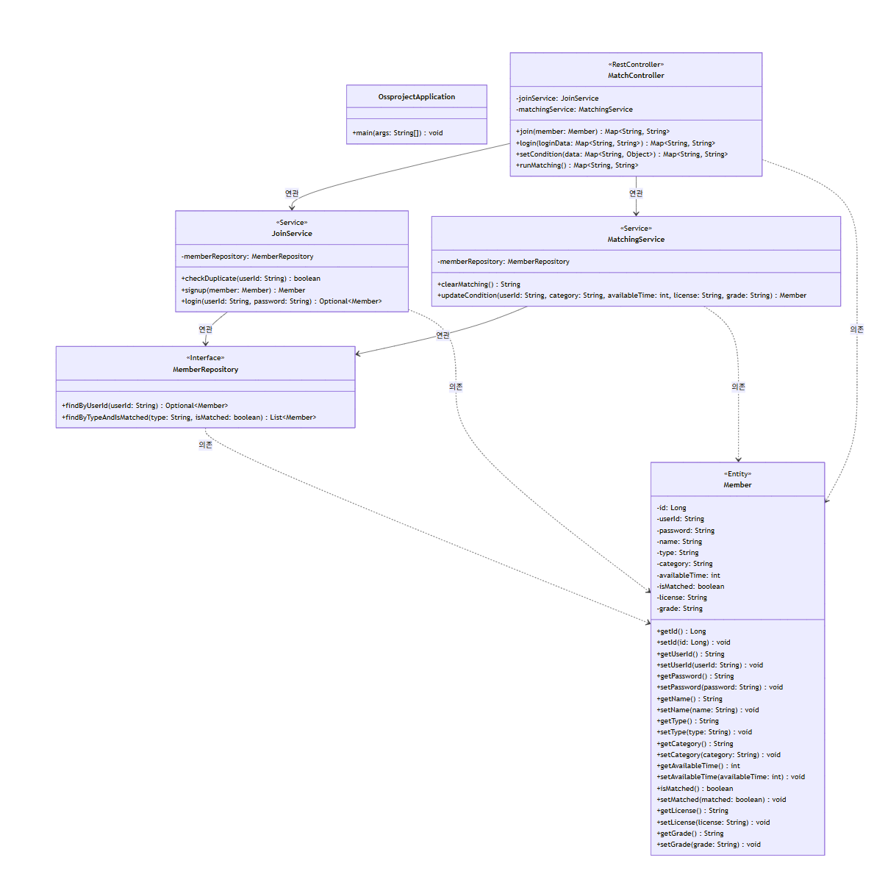
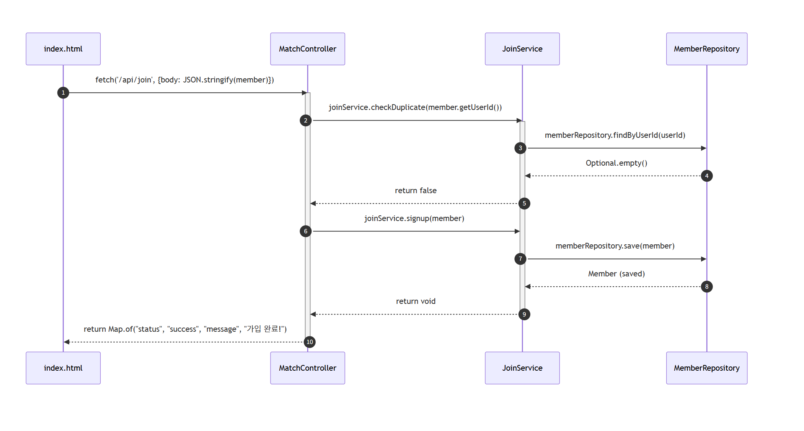
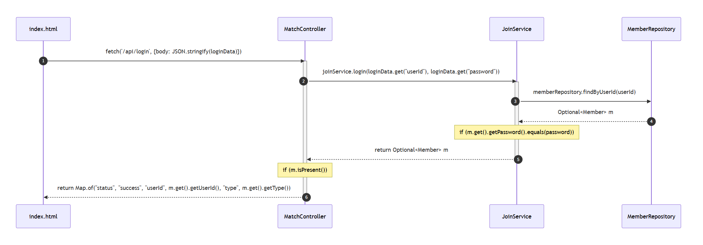
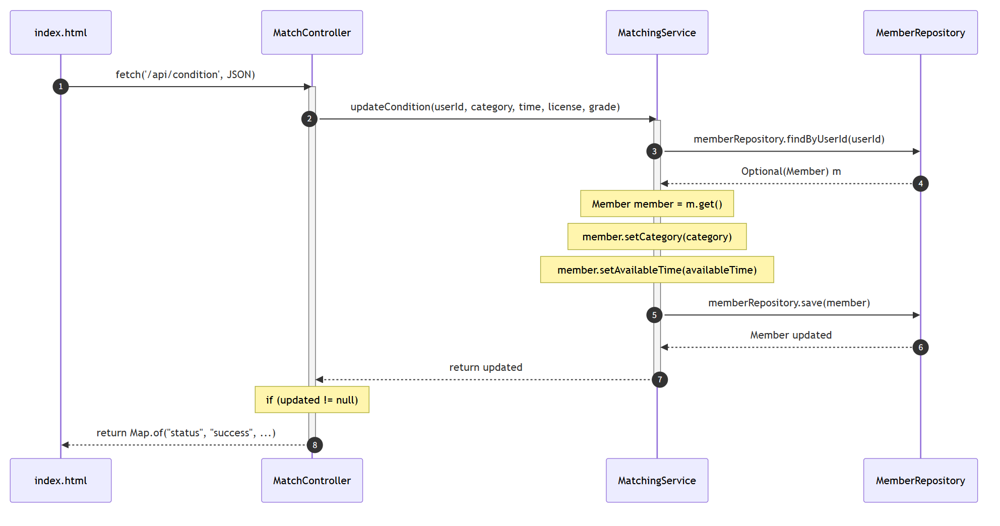
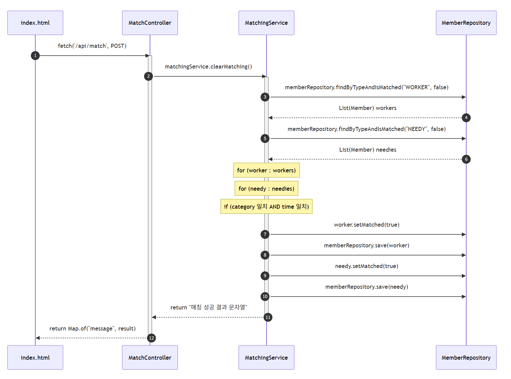
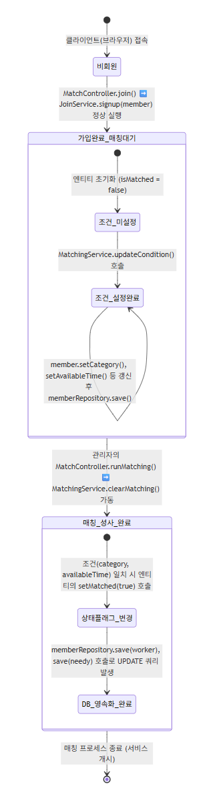

# ALways be your side

[22211972 이동준]
## [Revision history]

## Contents

### 1. Introduction----------------------------------------------------------------
    
### 2. Use case analysis----------------------------------------------------------

### 3. Domain analysis-----------------------------------------------------------

### 4. User Interface prototype--------------------------------------------------

### 5. Glossary-------------------------------------------------------------------

### 6. References-----------------------------------------------------------------

### 1. Introduction

1) Summary

현대 사회에서 맞춤형 돌봄 서비스의 수요가 지속적으로 증가함에 따라, 장애인(도움인)과 활동지원사를 적재적소에 연결하는 과정의 중요성 또한 커지고 있다. 그러나 기존의 매칭 프로세스는 대부분 복지 기관이나 중개 센터의 오프라인 수작업에 크게 의존하고 있어 정보의 비대칭 문제를 야기한다. 서비스 제공자와 수요자는 직접 기관에 방문하거나 개별 문의를 거치기 전까지는 자신과 맞는 조건(활동 시간대, 지원 카테고리 등)의 대기자가 존재하는지 파악하기 어렵다. 이는 결국 조건 불일치로 인한 잦은 매칭 실패와 서비스 지연이라는 양측의 불편함으로 직결된다.

이러한 오프라인 중심의 수동적 한계를 극복하고, 정보의 투명성을 높이기 위해 웹 기반의 플랫폼인 ‘케어 매칭 시스템’을 기획하게 되었다. 본 시스템은 기존에 관리자만이 통제하던 조건 등록 및 대기열 관리 프로세스를 실질적 이용자들에게 개방한다. 활동지원사와 도움인이 직접 시스템에 접속하여 맞춤형 조건(가사/이동/목욕 등 지원 분야, 가능 시간대, 자격 및 장애 등급)을 등록하면, 시스템의 매칭 알고리즘이 이를 분석하여 최적의 파트너를 식별한다. 결과적으로 이용자는 시공간의 제약 없이 신속하고 정확한 매칭을 기대할 수 있으며, 기관의 관리자 역시 단일 플랫폼 내에서 복잡한 중개 업무를 효율적으로 통합 제어할 수 있게 된다.

본 문서는 ‘케어 매칭 시스템’ 구축을 위한 세 번째 단계인 설계(Design) 보고서이다. 이전 분석 단계의 요구사항을 토대로 실제 소프트웨어 구현에 필요한 세부 아키텍처와 로직을 명세하며, 다이어그램(Class, Sequence, State Machine)을 적극 활용해 시스템의 정적인 구조와 동적인 데이터 흐름을 체계적이고 직관적으로 시각화하여 제시한다.
### [Revision history]
<table style = "width : 150%">
  <thead>
    <tr height="50">
      <th>Revisiom date</th>
      <th>Version #</th>
      <th>Description</th>
      <th>Author</th>
    </tr>
    <tr height="30">
      <td>26.06.05</td>
      <td>1.0</td>
      <td>First Writing</td>
      <td></td>
    </tr>
    <tr height="30">
      <td></td>
      <td></td>
      <td></td>
      <td></td>
    </tr>
    <tr height="30">
      <td></td>
      <td></td>
      <td></td>
      <td></td>
    </tr>
</table> 
      
### 2. Class diagram

<h3>1. Member (도메인/엔티티 클래스)</h3>
<table>
  <thead>
    <tr><th align="left" style="background-color: #f2f2f2;">Attributes</th></tr>
  </thead>
  <tbody>
    <tr><td><code>-id:Long</code> : 데이터베이스에서 회원 데이터를 식별하는 고유 번호 (기본키)</td></tr>
    <tr><td><code>-userId:String</code> : 회원이 로그인할 때 사용하는 아이디</td></tr>
    <tr><td><code>-password:String</code> : 회원의 로그인 비밀번호</td></tr>
    <tr><td><code>-name:String</code> : 회원의 실명</td></tr>
    <tr><td><code>-type:String</code> : 회원 유형 (WORKER: 활동지원사, NEEDY: 도움인)</td></tr>
    <tr><td><code>-category:String</code> : 매칭 지원 서비스 카테고리 (가사, 목욕, 이동보조)</td></tr>
    <tr><td><code>-availableTime:int</code> : 활동/도움 가능 시간대 (1: 오전, 2: 오후, 3: 저녁, 4: 무관)</td></tr>
    <tr><td><code>-isMatched:boolean = false</code> : 다른 유저와 매칭이 성사되었는지 여부를 확인하는 변수</td></tr>
    <tr><td><code>-license:String</code> : 활동지원사일 경우 자격증 번호를 저장하는 변수</td></tr>
    <tr><td><code>-grade:String</code> : 도움인(대상자)일 경우 장애 등급을 저장하는 변수</td></tr>
  </tbody>
  <thead>
    <tr><th align="left" style="background-color: #f2f2f2;">Methods</th></tr>
  </thead>
  <tbody>
    <tr><td><code>+getId(), +getUserId()...</code> : 각 속성값들을 가져오는 Getter 메서드들</td></tr>
    <tr><td><code>+setId(), +setUserId()...</code> : 각 속성값들을 수정하는 Setter 메서드들</td></tr>
  </tbody>
</table>
 

<h3>2. MemberRepository (데이터베이스 접근 인터페이스)</h3>
<table>
  <thead>
    <tr><th align="left" style="background-color: #f2f2f2;">Attributes</th></tr>
  </thead>
  <tbody>
    <tr><td>(인터페이스이므로 속성 없음)</td></tr>
  </tbody>
  <thead>
    <tr><th align="left" style="background-color: #f2f2f2;">Methods</th></tr>
  </thead>
  <tbody>
    <tr><td><code>+findByUserId(userId:String) : Optional&lt;Member&gt;</code> : 전달받은 아이디(userId)로 데이터베이스에서 회원 정보를 검색하여 반환함</td></tr>
    <tr><td><code>+findByTypeAndIsMatched(type:String, isMatched:boolean) : List&lt;Member&gt;</code> : 회원 유형(type)과 매칭 여부(isMatched)를 기준으로 조건에 맞는 회원 목록을 검색하여 반환함</td></tr>
    <tr><td><code>+save(member:Member) : Member</code> : (JPA 기본 제공) 새로운 회원 정보를 저장하거나 기존 정보를 업데이트함</td></tr>
  </tbody>
</table>
 

<h3>3. JoinService (회원가입 및 로그인 서비스 클래스)</h3>
<table>
  <thead>
    <tr><th align="left" style="background-color: #f2f2f2;">Attributes</th></tr>
  </thead>
  <tbody>
    <tr><td><code>-memberRepository:MemberRepository</code> : 데이터베이스에 접근하여 회원 정보를 처리하기 위해 사용하는 변수</td></tr>
  </tbody>
  <thead>
    <tr><th align="left" style="background-color: #f2f2f2;">Methods</th></tr>
  </thead>
  <tbody>
    <tr><td><code>+checkDuplicate(userId:String) : boolean</code> : 입력받은 아이디가 이미 데이터베이스에 존재하는지 중복 여부를 확인함</td></tr>
    <tr><td><code>+signup(member:Member) : Member</code> : 클라이언트가 넘겨준 회원 정보를 데이터베이스에 새로 저장(가입)함</td></tr>
    <tr><td><code>+login(userId:String, password:String) : Optional&lt;Member&gt;</code> : 아이디로 회원을 찾고, 비밀번호가 일치하는지 검증하여 로그인 처리를 수행함</td></tr>
  </tbody>
</table>
 

<h3>4. MatchingService (매칭 및 조건 업데이트 서비스 클래스)</h3>
<table>
  <thead>
    <tr><th align="left" style="background-color: #f2f2f2;">Attributes</th></tr>
  </thead>
  <tbody>
    <tr><td><code>-memberRepository:MemberRepository</code> : 데이터베이스에 접근하여 매칭 정보를 갱신하기 위해 사용하는 변수</td></tr>
  </tbody>
  <thead>
    <tr><th align="left" style="background-color: #f2f2f2;">Methods</th></tr>
  </thead>
  <tbody>
    <tr><td><code>+clearMatching() : String</code> : 매칭되지 않은 활동지원사와 도움인 목록을 불러와 카테고리와 시간대 조건이 맞는 쌍을 찾아 매칭 상태를 true로 변경하고 결과 메시지를 반환함</td></tr>
    <tr><td><code>+updateCondition(userId:String, category:String, availableTime:int, license:String, grade:String) : Member</code> : 유저 아이디로 회원을 찾아 입력받은 매칭 조건(카테고리, 시간, 자격증, 등급)을 업데이트함</td></tr>
  </tbody>
</table>
 

<h3>5. MatchController (웹 요청 처리 컨트롤러 클래스)</h3>
<table>
  <thead>
    <tr><th align="left" style="background-color: #f2f2f2;">Attributes</th></tr>
  </thead>
  <tbody>
    <tr><td><code>-joinService:JoinService</code> : 회원가입 및 로그인 비즈니스 로직을 호출하기 위해 사용하는 변수</td></tr>
    <tr><td><code>-matchingService:MatchingService</code> : 조건 설정 및 매칭 알고리즘 로직을 호출하기 위해 사용하는 변수</td></tr>
  </tbody>
  <thead>
    <tr><th align="left" style="background-color: #f2f2f2;">Methods</th></tr>
  </thead>
  <tbody>
    <tr><td><code>+join(member:Member) : Map&lt;String, String&gt;</code> : 클라이언트로부터 회원가입 요청을 받아 처리하고 성공/실패 메시지를 JSON(Map) 형태로 반환함</td></tr>
    <tr><td><code>+login(loginData:Map&lt;String, String&gt;) : Map&lt;String, String&gt;</code> : 클라이언트로부터 로그인 요청(ID, PW)을 받아 검증하고 결과 및 유저 역할(Type)을 반환함</td></tr>
    <tr><td><code>+setCondition(data:Map&lt;String, Object&gt;) : Map&lt;String, String&gt;</code> : 클라이언트로부터 매칭 조건 설정 데이터를 받아 업데이트 로직을 실행하고 결과를 반환함</td></tr>
    <tr><td><code>+runMatching() : Map&lt;String, String&gt;</code> : 관리자의 자동 매칭 실행 요청을 받아 매칭 엔진을 가동하고 결과 메시지를 화면에 반환함</td></tr>
  </tbody>
</table>
 

<h3>6. OssprojectApplication (메인 실행 클래스)</h3>
<table>
  <thead>
    <tr><th align="left" style="background-color: #f2f2f2;">Attributes</th></tr>
  </thead>
  <tbody>
    <tr><td>(속성 없음)</td></tr>
  </tbody>
  <thead>
    <tr><th align="left" style="background-color: #f2f2f2;">Methods</th></tr>
  </thead>
  <tbody>
    <tr><td><code>+main(args:String[]) : void</code> : 스프링 부트 애플리케이션 서버를 메모리에 올리고 구동시키는 메인 메서드</td></tr>
  </tbody>
</table>

### 3. Sequence diagram

1. 회원가입 (Join)

클라이언트(브라우저)에서 사용자가 입력한 회원 정보가 JSON 형태로 MatchController의 /api/join 엔드포인트로 전송되며 회원가입 프로세스가 시작됩니다.
컨트롤러는 가장 먼저 JoinService.checkDuplicate()를 호출하여 MemberRepository를 통해 DB에 동일한 아이디가 존재하는지 검증합니다. 중복이 아님(Optional.empty)이 확인되면, 컨트롤러는 JoinService.signup()을 호출하여 전달받은 Member 엔티티를 DB에 영속화(save)합니다. 이때 매칭 여부를 나타내는 isMatched 속성은 기본값인 false로 초기화되어 저장되며, 최종적으로 컨트롤러는 클라이언트에게 성공 상태(success)와 완료 메시지를 Map 형태로 직렬화하여 응답합니다.

2. 로그인 (Login)

사용자가 입력한 ID와 비밀번호를 MatchController가 수신하여 JoinService.login() 메서드로 전달합니다. 서비스 계층은 MemberRepository.findByUserId()를 호출해 DB에서 해당 유저의 Member 엔티티를 Optional 객체로 인출합니다.
이후 내부 로직에서 DB에 저장된 비밀번호와 사용자가 입력한 비밀번호의 일치 여부를 검증(equals())하고, 인증이 완료되면 해당 엔티티를 컨트롤러로 반환합니다. 컨트롤러는 반환받은 엔티티에서 유저의 역할(type) 정보를 추출해 응답 객체에 담아 클라이언트로 전송하며, 프론트엔드는 이 type 값(WORKER 또는 NEEDY)에 따라 이후 나타나는 화면의 UI(자격증 입력 폼 또는 장애 등급 입력 폼)를 동적으로 렌더링합니다.

3. 매칭 조건 등록 (Condition Update)

로그인을 완료한 유저가 자신의 활동 시간, 카테고리, 그리고 역할에 따른 추가 정보(자격증 번호 또는 장애 등급)를 입력하고 저장 버튼을 누르면 발생하는 흐름입니다.
요청을 받은 MatchController는 파라미터를 캐스팅하여 MatchingService.updateCondition()으로 전달합니다. 서비스는 아이디를 기반으로 DB에서 기존 Member 엔티티를 조회한 뒤, 엔티티 내부의 Setter 메서드(setCategory, setAvailableTime 등)를 호출하여 클라이언트가 넘겨준 새로운 조건 데이터로 메모리 상의 객체를 갱신합니다. 이후 갱신된 객체를 MemberRepository.save()를 통해 DB에 반영(UPDATE)하고 성공 메시지를 클라이언트에게 반환합니다.

4. 자동 매칭 실행 (Run Matching)

관리자가 시스템 관리 모드에서 '자동 매칭 실행' 버튼을 클릭했을 때 트리거되는 시스템의 핵심 비즈니스 로직입니다. MatchController의 요청을 받은 MatchingService.clearMatching() 메서드는 MemberRepository.findByTypeAndIsMatched() 쿼리 메서드를 두 번 호출하여, 아직 매칭되지 않은(isMatched == false) 활동지원사(WORKER) 리스트와 도움인(NEEDY) 리스트를 각각 DB에서 인출합니다.이후 인메모리 상에서 이중 for문을 돌며 지원사와 도움인의 '서비스 카테고리' 및 '가능 시간대'가 완벽하게 일치하는지(equals() 및 == 연산) 비교 분석합니다. 조건이 부합하는 짝을 발견하면 즉시 두 엔티티의 isMatched 상태를 true로 변경하고 DB에 업데이트(save) 처리합니다. 마지막으로 매칭이 성사된 두 회원의 이름을 포함한 결과 문자열을 컨트롤러로 반환하여 관리자 화면에 알림창으로 출력하게 됩니다.

### 4.State machine diagram

사용자가 매칭 시스템에 처음 접속하면 비회원 상태로 화면이 보여진다. 새로운 사용자가 회원 유형(활동지원사 또는 도움인)을 선택하고 회원가입을 완료하면, 데이터베이스에 등록되며 조건 미설정 상태가 된다. 이후 사용자가 로그인을 수행하고 이용자 프로필 메뉴에서 자신의 활동 가능 시간대, 지원 카테고리, 그리고 역할에 따른 추가 정보(자격증 번호 또는 장애 등급)를 입력하여 저장 버튼을 누르면, 시스템은 해당 사용자를 조건 설정 완료(매칭 대기) 상태로 전환하여 실시간 매칭 알고리즘의 대상자로 포함시킨다. 이 대기 상태에서는 언제든지 자신의 매칭 조건을 수정할 수 있다.

이후 관리자가 특정 시점에 시스템 관리 모드에서 '자동 매칭 실행' 버튼을 누르면, 서버는 대기 중인 활동지원사와 도움인들의 조건을 비교 분석한다. 시스템이 서비스 카테고리와 시간대가 완벽하게 일치하는 파트너를 발견하면, 즉시 두 사용자의 내부 상태 플래그를 매칭 성사 완료(isMatched = true) 상태로 변경한다. 매칭이 성사된 사용자들은 데이터베이스에 갱신되어 자동 매칭 대기열에서 완전히 제거되며, 본격적인 파트너 연결 및 돌봄 개시 상태로 넘어가게 된다.
### 5. Implementation requirements

1. H/W platform requirements (서버 및 개발 환경 기준)

(1) CPU : Intel Core i5 (또는 동급 AMD 프로세서) 2.0GHz 이상

(2) RAM : 8GB 이상 (최소 4GB 이상)

(3) HDD / SSD : 50GB 이상의 여유 공간

2. S/W platform requirements

(1) OS : Windows 10/11, macOS, Linux 등 (Java 구동 가능 OS 지원)

(2) Implementation Language : Java (JDK 17 이상), HTML5, CSS3, JavaScript(Vanilla)

(3) Framework : Spring Boot, Spring Data JPA

(4) Database : H2 Database (In-Memory 또는 파일 모드)

(5) Client Environment : Google Chrome, Microsoft Edge, Apple Safari 등 최신 모던 웹 브라우저

### 6.Glossary

### 6. Glossary

| TERMS | Description |
| :--- | :--- |
| **활동지원사 (Worker)** | 본 시스템을 통해 자신의 활동 가능 시간, 지원 카테고리, 자격증 정보를 등록하고 돌봄 서비스를 제공하는 주체(사용자)를 가리킴. |
| **도움인 (Needy)** | 본 시스템을 통해 자신이 필요로 하는 돌봄 카테고리와 시간대, 장애 등급을 등록하고 매칭을 대기하는 대상자(사용자)를 가리킴. |
| **Entity (엔티티)** | 객체지향 프로그래밍에서 데이터베이스의 테이블과 직접적으로 1:1 매핑되어 데이터를 운반하고 저장하는 핵심 모델 클래스 (예: `Member`). |
| **Class Diagram** | 객체지향 시스템 설계에서, 시스템을 구성하는 클래스와 인터페이스의 정적인 구조(속성, 메서드) 및 그들 간의 연관·의존 관계를 도식으로 정의한 것. |
| **Sequence Diagram** | 특정 로직(예: 매칭 알고리즘 실행)이 수행될 때, 시간의 흐름에 따라 브라우저부터 컨트롤러, 데이터베이스까지 객체 간에 오가는 메시지와 동적 상호작용을 시각화한 다이어그램. |
| **State Machine Diagram** | 시스템 내 특정 객체(예: 이용자 정보)가 가입, 조건 설정, 매칭 완료 등 일련의 이벤트 발생에 따라 어떠한 조건과 흐름으로 내부 상태(State)가 전이되는지 설명하는 모델링 도식. |

 

### 7.References
